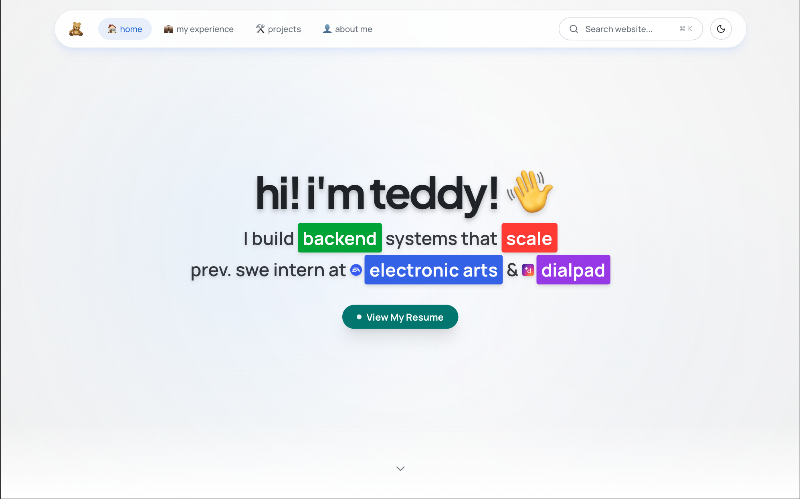

# NextPortfolio



A Sleek Next.js Portfolio Website inspired by Cluely

NextPortfolio is Teddy Malhan's personal portfolio site. It showcases projects, experience, and contact information with rich animations and an accessible component system. It is built on the Next.js App Router with Turbopack, and ships theme switching, form validation, and integrated analytics out of the box.

## Table of Contents

- [Background](#background)
- [Install](#install)
- [Usage](#usage)
- [Deployment](#deployment)
- [Maintainers](#maintainers)
- [Acknowledgements](#acknowledgements)
- [Contributing](#contributing)
- [License](#license)

## Background

The project exists as a single-page portfolio that demonstrates current front-end practices: the App Router for routing, Radix UI primitives for accessibility, Framer Motion and GSAP for motion, and React Hook Form with Zod for validated contact submissions. It is intended both as a personal site and as a reference implementation for similar portfolios.

See Also:

- [Next.js](https://nextjs.org/)
- [Radix UI](https://www.radix-ui.com/)
- [shadcn/ui](https://ui.shadcn.com/)

## Install

This project uses [Node.js](https://nodejs.org/) and [pnpm](https://pnpm.io/). Please make sure they are installed locally.

```sh
git clone https://github.com/teddymalhan/teddy-portfolio-rebuild.git
cd teddy-portfolio-rebuild
pnpm install
```

### Dependencies

- Node.js 18.0 or later
- pnpm (or npm)

Optional environment variables for analytics, blob storage, database, and authentication may be configured in `.env.local`. See the imports of `@vercel/analytics`, `@vercel/blob`, `@neondatabase/serverless`, and `@clerk/nextjs` for details.

## Usage

Start the development server:

```sh
pnpm dev
```

Then open [http://localhost:3000](http://localhost:3000).

Build and run a production bundle:

```sh
pnpm build
pnpm start
```

### CLI

The project exposes the standard Next.js scripts via `pnpm`:

```sh
pnpm dev      # start dev server
pnpm build    # production build
pnpm start    # serve production build
pnpm lint     # run ESLint
```

## Deployment

The site is designed to be deployed on [Vercel](https://vercel.com). Push to the connected GitHub repository and Vercel will build and deploy automatically. For static hosting, set `output: "export"` in `next.config.mjs` and serve the `out/` directory.

## Maintainers

[@teddymalhan](https://github.com/teddymalhan)

## Acknowledgements

- [Next.js](https://nextjs.org/)
- [Tailwind CSS](https://tailwindcss.com/)
- [Radix UI](https://www.radix-ui.com/)
- [shadcn/ui](https://ui.shadcn.com/)
- [Framer Motion](https://www.framer.com/motion/)

## Contributing

Feel free to open an [issue](https://github.com/teddymalhan/teddy-portfolio-rebuild/issues) or submit a PR. Small PRs are preferred; please run `pnpm lint` before submitting. Questions can be asked in the issues tracker.

This project follows the [Contributor Covenant](https://www.contributor-covenant.org/) Code of Conduct.

## License

[GPL-3.0-or-later](LICENSE.md) © Teddy Malhan
